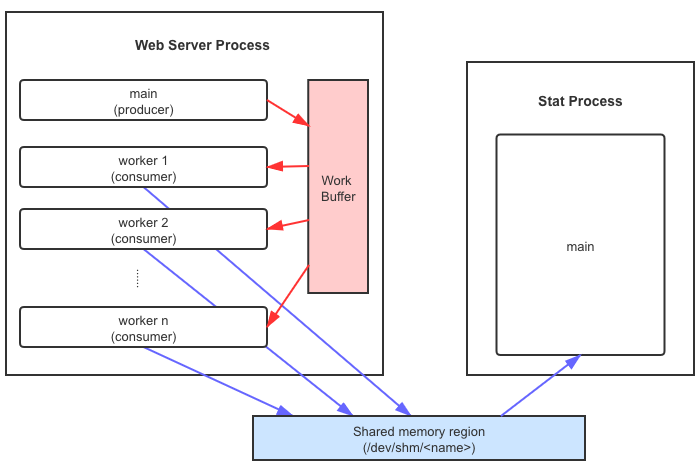

# CS537 SP2021 DIS-315 Week 13

<!-- Copyright 2021 Guanzhou Hu -->

Topics:

- Web server architecture
- Multi-threading w/ `pthread`
- Shared memory w/ `shm`
- Signal handler
- P7 overview & tips

Links:

- POSIX `pthread` tutorial: [https://www.cs.cmu.edu/afs/cs/academic/class/15492-f07/www/pthreads.html](https://www.cs.cmu.edu/afs/cs/academic/class/15492-f07/www/pthreads.html)
- POSIX shared-memory tutorial: [https://www.geeksforgeeks.org/posix-shared-memory-api/](https://www.geeksforgeeks.org/posix-shared-memory-api/)
- User-defined signal handler with `signal`: [https://www.geeksforgeeks.org/signals-c-language/](https://www.geeksforgeeks.org/signals-c-language/)

## Web Server Architecture

The overall architecture for this project looks like:

There is a clear separation into two parts:

- Part A: making the web server multi-threaded, workers grab work from a work buffer (red arrows)
- Part B: make a stat process, use shared memory to share statistics between two processes (blue arrows)

## Multithreading w/ POSIX `pthread`

See `multi-threading.c` for examples of the POSIX `pthread` API. **You need `-lpthread` compiler flag to indicate you are linking against the pthread library**.

For this project, we have requirements on the multi-threading model:
- **Fixed-size thread pool** created beforehand
    - Main thread creates a fixed number of children threads
    - Then, main thread goes into an infinite loop of accepting client requests, get connection `connfd`
    - Worker threads just do an infinite loop of grabbing `connfd` from the buffer, handling the request, and closing the connection
- **Fixed-size, static work buffer**
    - Main thread puts `connfd` into the buffer, if there is any empty slot
    - Worker thread fetches `connfd` from the buffer, if buffer is not empty
    - Use **condition variables** to synchronize

This is exactly a producer-consumer model! We just have multiple consumers.

**Question: How many condition variables do we need** to synchronize the accesses on the work buffer?

**Answer:** we need two: `buf_not_full` and `buf_not_empty`.

## Shared Memory across Processes w/ POSIX `shm`

See `shared-memory-wr.c` & `shared-memory-rd.c` for examples of the POSIX `shm` API. **You need `-lrt` compiler flag to indicate you are linking against the real-time library** (which the `shm` API is part of).

- To create a shared memory region: `shm_open()` with `O_RDWR | O_CREAT` in the flags
    - This creates the shared memory "fake" file if the name does not exist, and returns you a file descriptor
    - Then do `ftruncate()` to extend the size of the shared memory to your desired size
- To open an existing shared memory region: `shm_open()` with just `O_RDWR` in the flags
    - Assumes the shared memory name has been created before, and returns you a file descriptor
- With the fd, do memory map `mmap()` to map it into the process address space
    - Gives you a memory pointer, which you can then use to access/modify bytes in the shared memory region
- For safety, recommended to do `munmap()` when no longer needs the shared memory
- To delete a shared memory region: `shm_unlink()`

Typically, there should be some synchronization mechanisms to let multiple processes synchronize on the access to the shared memory region, so that no one writes partial data or reads out corrupted data. For this project, you don't need to worry about such synchronization. It is OK for the stat process to temporarily read out something inconsistent.

<ins>One thing you need to think about</ins>: Each worker thread should write statistics into its own slot in the shared memory region.

## User-Defined Signal Handler

The web server's main thread is in an infinite loop. To end the web server process, we need to send a `SIGINT` signal (Ctrl-C from a UNIX shell, indicating termination). Normally, a C program just terminates when receiving SIGINT.

However, we want some extra work to be done at termination. In particular, we need to clean up the shared memory segment.

So, we need a user-defined signal handler, and "register" it with SIGINT. Then, when the process receives SIGINT, it calls back this handler function.

See `signal-handler.c` for examples of registering a signal handler using `signal()`.

## P7 Overview & Tips

I pretty covered everything about P7 in the above four sections.

Tips:
- Split into two parts - multi-threading and shared memory, they are quite orthogonal.
- All basic user-level programming! Nothing in kernel, should be easier to do than P4-P6.
